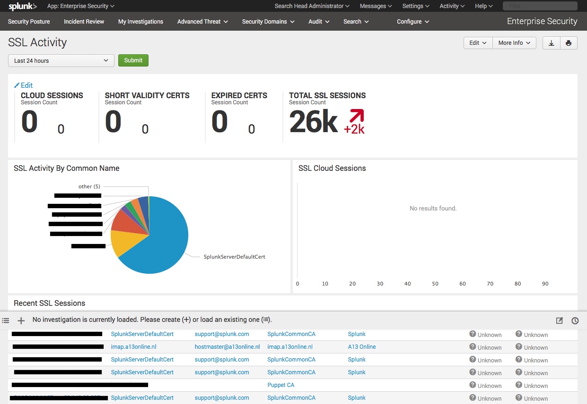
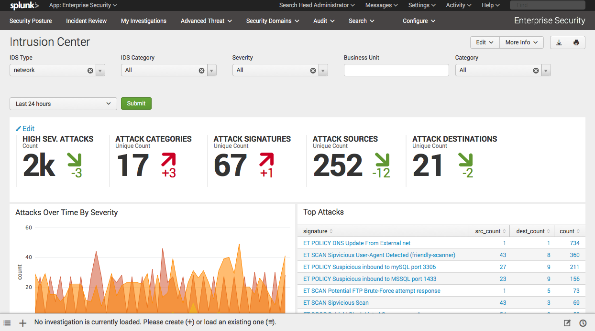

# Splunk TA for Suricata

This CIM compliant Splunk TA can be used with Splunk Enterprise Security and
provides field extractions, aliases, tags for the following Suricata eve-log
outputs:

* alert
* tls

This fills the SSL Activity panel under Protocol Intelligence, and Intrusion Center under Security Domains -> Network in
Splunk Enterprise Security:





## Installation

Install this Splunk TA on your Splunk (Enterprise Security) search head. Make
sure to rename it Splunk_TA_suricata or TA-suricata otherwise ES won't eat it.

## Configuration 

Have the log files indexed by a Splunk Universal Forwarder with sourcetypes
`suricata_eve`. For example with the following inputs.conf:

```
[monitor:///var/log/suricata/eve.json]
disabled = false
sourcetype = suricata_eve
index=suricata
```

## CIM 

The TA provides fields compatible with the Splunk Common Information Model (CIM):

* action
* category
* ids_type = network
* severity
* src
* src_ip
* dest
* dest_ip
* signature
* signature_id
* ssl_hash
* ssl_version
* ssl_serial
* ssl_subject_common_name
* ssl_subject_email
* ssl_subject_locality
* ssl_subject_organization
* ssl_issuer_common_name
* ssl_issuer_email
* ssl_issuer_locality
* ssl_issuer_organization
* transport
* vendor_product = Suricata
